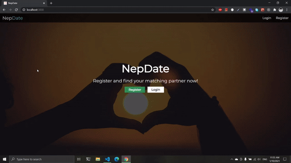

# nepdate

### A dating web app

#### Demo ⤵



<p>
In order to run this project locally, create a .env file in the working directory with the following key value pairs:
</p>

```
DB_URI=paste_your_mongodb_connection_uri_here
JWT_SECRET=choose_a_random_jwt_secret_here
CLOUDINARY_CLOUD_NAME=paste_your_cloudinary_cloud_name_here
CLOUDINARY_API_KEY=paste_your_cloudinary_api_key_here
CLOUDINARY_API_SECRET=paste_your_cloudinary_api_secret_here
```
